This is a [Next.js](https://nextjs.org/) project bootstrapped with [`create-next-app`](https://github.com/vercel/next.js/tree/canary/packages/create-next-app).

## Getting Started

First, run the development server:

```bash
npm run dev
# or
yarn dev
# or
pnpm dev
# or
bun dev
```

Open [http://localhost:3000](http://localhost:3000) with your browser to see the result.

You can start editing the page by modifying `app/page.tsx`. The page auto-updates as you edit the file.

This project uses [`next/font`](https://nextjs.org/docs/basic-features/font-optimization) to automatically optimize and load Inter, a custom Google Font.

## Laporan Praktikum

|  | Pemrograman Berbasis Framework 2025 |
|--|--|
| NIM |  2241720016|
| Nama |  Nurhaliza Anindya Putri |
| Kelas | TI - 3D |

##  Langkah-langkah Praktikum 
### Persiapan Lingkungan

1. Pastikan Node.js dan npm sudah terinstal di komputer Anda. Anda dapat memeriksanya dengan menjalankan perintah berikut di terminal atau command prompt: 

> 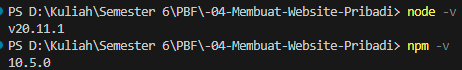

2. Buat direktori baru untuk proyek Next.js Anda: 
mkdir website-pribadi 
cd website-pribadi 

> 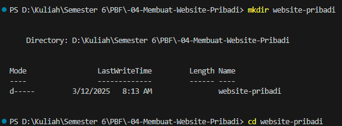

3. Inisialisasi proyek Next.js dengan TypeScript dan App Router: 
npx create-next-app@latest . --typescript –app 

> 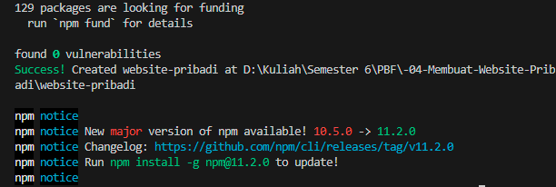

4. Cek konfigurasi postcss.config.mjs: 

> 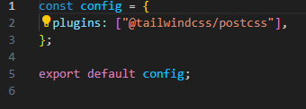

5. Cek di app/globals.css, sudah ada import untuk tailwindcss: 

> 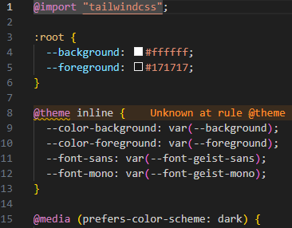

6. Buka app/layout.tsx, tambahkan import './globals.css', dan modifikasi menjadi sebagai berikut: 

> 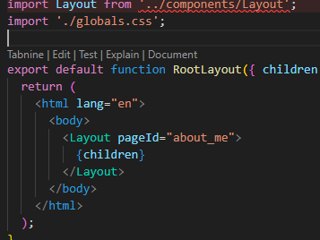
> keterangan: terjadi error karena components/layout belum dibuat dan akan dibuat dipraktikum ke 3

7. Jalankan aplikasi Next.js: 
npm run dev 
Aplikasi akan terbuka di browser pada alamat http://localhost:3000. 

> 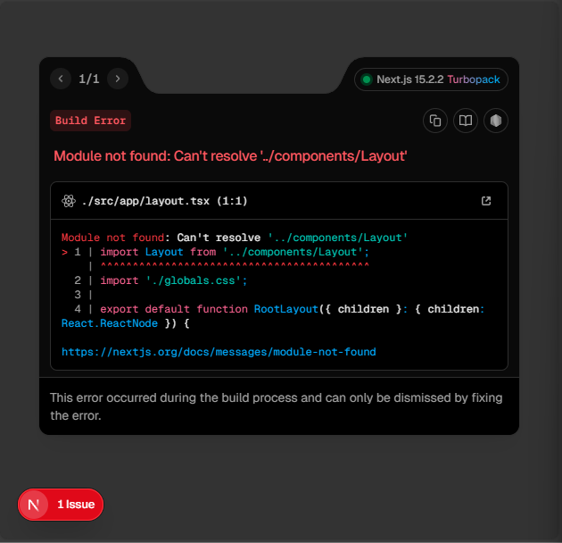

### Membuat Halaman Website 
1. Buat file app/page.tsx sebagai halaman "Tentang Saya": 

> 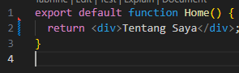

2. Buat file app/projects/page.tsx sebagai halaman "Proyek": 

> 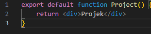

3. Buat file app/essays/page.tsx sebagai halaman "Esai": 

> 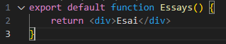

4. Buka browser dan akses: 
    - http://localhost:3000/ untuk halaman "Tentang Saya". 
    - http://localhost:3000/projects untuk halaman "Proyek". 
    - http://localhost:3000/essays untuk halaman "Esai".

> 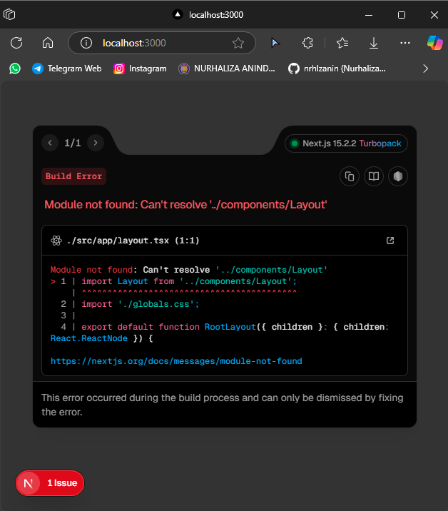
> 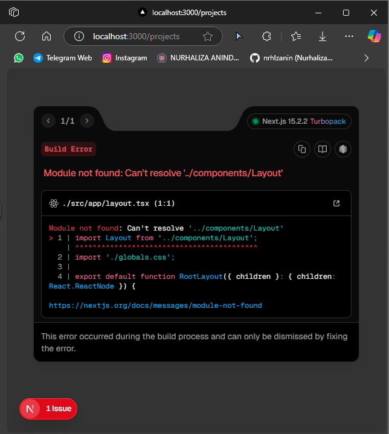
> 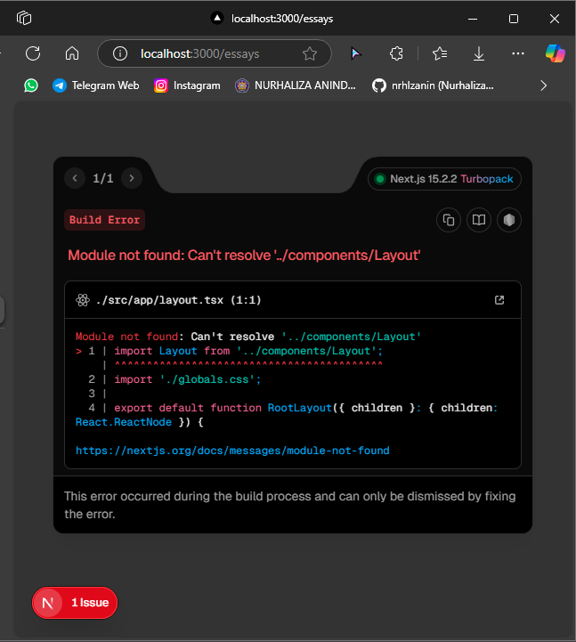
