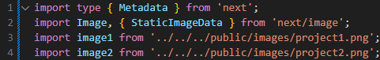

This is a [Next.js](https://nextjs.org/) project bootstrapped with [`create-next-app`](https://github.com/vercel/next.js/tree/canary/packages/create-next-app).

## Getting Started

First, run the development server:

```bash
npm run dev
# or
yarn dev
# or
pnpm dev
# or
bun dev
```

Open [http://localhost:3000](http://localhost:3000) with your browser to see the result.

You can start editing the page by modifying `app/page.tsx`. The page auto-updates as you edit the file.

This project uses [`next/font`](https://nextjs.org/docs/basic-features/font-optimization) to automatically optimize and load Inter, a custom Google Font.

## Laporan Praktikum

|  | Pemrograman Berbasis Framework 2025 |
|--|--|
| NIM |  2241720016|
| Nama |  Nurhaliza Anindya Putri |
| Kelas | TI - 3D |

##  Langkah-langkah Praktikum 
### Persiapan Lingkungan

1. Pastikan Node.js dan npm sudah terinstal di komputer Anda. Anda dapat memeriksanya dengan menjalankan perintah berikut di terminal atau command prompt: 

> 

2. Buat direktori baru untuk proyek Next.js Anda: 
mkdir website-pribadi 
cd website-pribadi 

> 

3. Inisialisasi proyek Next.js dengan TypeScript dan App Router: 
npx create-next-app@latest . --typescript –app 

> 

4. Cek konfigurasi postcss.config.mjs: 

> 

5. Cek di app/globals.css, sudah ada import untuk tailwindcss: 

> 

6. Buka app/layout.tsx, tambahkan import './globals.css', dan modifikasi menjadi sebagai berikut: 

> 
> keterangan: terjadi error karena components/layout belum dibuat dan akan dibuat dipraktikum ke 3

7. Jalankan aplikasi Next.js: 
npm run dev 
Aplikasi akan terbuka di browser pada alamat http://localhost:3000. 

> 

### Membuat Halaman Website 
1. Buat file app/page.tsx sebagai halaman "Tentang Saya": 

> 

2. Buat file app/projects/page.tsx sebagai halaman "Proyek": 

> 

3. Buat file app/essays/page.tsx sebagai halaman "Esai": 

> 

4. Buka browser dan akses: 
    - http://localhost:3000/ untuk halaman "Tentang Saya". 

> 

    - http://localhost:3000/projects untuk halaman "Proyek". 

> 

    - http://localhost:3000/essays untuk halaman "Esai".

> 

### Membuat Layout dan Navigasi 
1. Buat direktori src/components jika belum ada. 
2. Buat file src/components/Layout.tsx: 

> 

3. Buat file src/components/Navbar.tsx

```bash
'use client';
import { usePathname } from 'next/navigation';
import Link from 'next/link';

type NavItemProps = {
  title: string;
  url: string;
  isSelected: boolean;
};

function NavItem({ title, url, isSelected }: NavItemProps) {
  return (
    <li>
      <a
        className={`block px-3 py-2 transition hover:text-teal-500 ${
          isSelected ? "text-teal-500" : ""
        }`}
        href={url}
      >
        {title}
      </a>
    </li>
  );
}

export default function Navbar() {
  const pathname = usePathname();

  return (
    <div className="flex justify-center mx-auto max-w-7xl h-16 pt-6">
      <nav>
        <ul className="flex rounded-full bg-white/90 px-3 text-sm font-medium text-zinc-800 shadow-lg shadow-zinc-800/5 ring-1 ring-zinc-900/5 backdrop-blur">
          <NavItem title="Tentang Saya" url="/" isSelected={pathname === '/'} />
          <NavItem title="Proyek" url="/projects" isSelected={pathname === '/projects'} />
          <NavItem title="Esai" url="/essays" isSelected={pathname === '/essays'} />
        </ul>
      </nav>
    </div>
  );
}
```

4. Buat file src/components/Footer.tsx 

> 
 
5. Update file app/layout.tsx untuk menggunakan layout: 

> 

6. Update setiap halaman menambahkan metadata dengan generateMetadata: 

> 

Lakukan hal yang sama untuk halaman projects/page.tsx dan essays/page.tsx.

> 

### Membuat Halaman Proyek dengan Grid Responsif 
1. Buat folder di public/images. Kemudian tambahkan dua image, lalu rename dengan nama 
project1.png dan project2.png 
2. Modifikasi file app/projects/page.tsx: 
Tambahkan import next/image dan beberapa image yang telah ditambahkan sebelumnya 

> 

Buat card project item sebagai berikut: 

> 

Modifikasi komponen project sebagai berikut: 

> 

3. Simpan file dan buka http://localhost:3000/projects di browser. Anda akan melihat daftar proyek 
dalam grid yang responsif. 

> 

## Tugas 
Eksplorasi Tailwindcss, kemudian. 
1. Modifikasi halaman "Esai" dengan Grid daftar artikel yang telah ditulis. 

> 

2. Modifikasi halaman “Tentang Saya” Buat tampilan yang menarik 

> 
